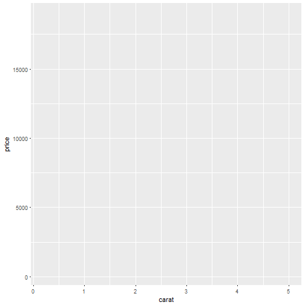
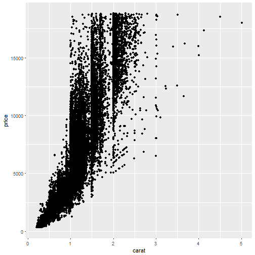

ggplot2: An Introduction
========================================================
author: Karl Hailperin
date: 
autosize: true

What is ggplot2?
========================================================

- Data visualization package created by Hadley Wickham, co-authored with Winston Chang
- Inspired by Leland Wilkinson's book *The Grammar of Graphics*
    + Hadley wrote about his take on TGoG and ggplot2 in his paper ["A Layered Grammar of Graphics"](http://vita.had.co.nz/papers/layered-grammar.html)
- Between [RStudio's cheetsheet](https://www.rstudio.com/wp-content/uploads/2015/12/ggplot2-cheatsheet-2.0.pdf) and the [ggplot2 website](http://docs.ggplot2.org), lots of great documentation

What do I need before I start plotting?
========================================================

- the ggplot2 package
- The data you want to plot needs to be in a [tidy data frame](https://github.com/khailper/Tidy-Data-Presentation)
- ggplot objects can be memory-intensive, so dplyr::select is your friend
- Note: [qplot function](http://docs.ggplot2.org/current/qplot.html) is a plot-like function that plays well with the ggplot2 framework.

How do I get started?
========================================================

```r
library(ggplot2)
g <- ggplot(data=diamonds, aes(x=carat, y=price))
```

What does that do?
========================================================

```r
g
```



Alright, how do I actually create a plot?
========================================================


```r
basic_scatter <- g + geom_point()
basic_scatter
```


