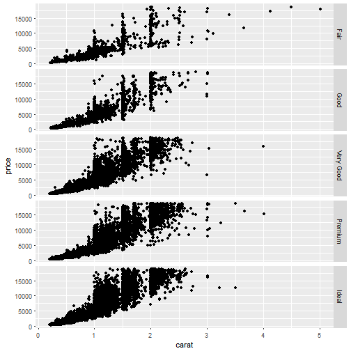

ggplot2: An Introduction
========================================================
author: Karl Hailperin
date: March 16, 2017
autosize: true

What is ggplot2?
========================================================

- Data visualization package created by Hadley Wickham, co-authored with Winston Chang
- Inspired by Leland Wilkinson's book *The Grammar of Graphics*
    + Hadley wrote about his take on TGoG and ggplot2 in his paper ["A Layered Grammar of Graphics"](http://vita.had.co.nz/papers/layered-grammar.html) and his aptly-named book [_ggplot2_](https://github.com/hadley/ggplot2-book) (also available at [Amazon](https://www.amazon.com/dp/0387981403/ref=cm_sw_su_dp?tag=ggplot2-20))
- Between [RStudio's cheetsheet](https://www.rstudio.com/wp-content/uploads/2015/12/ggplot2-cheatsheet-2.0.pdf) and the [ggplot2 website](http://docs.ggplot2.org), lots of great documentation

What do I need before I start plotting?
========================================================

- the ggplot2 package
- The data you want to plot needs to be in a [tidy data frame](https://github.com/khailper/Tidy-Data-Presentation)
- ggplot objects can be memory-intensive, so dplyr::select is your friend
- Note: [qplot function](http://docs.ggplot2.org/current/qplot.html) is a plot-like function that plays well with the ggplot2 framework.

How do I get started?
========================================================

```r
library(ggplot2)
library(dplyr)
diamond_data <- select(diamonds, carat, price, cut, clarity, depth)
g <- ggplot(data = diamond_data, aes(x = carat, y = price))
```

What does that do?
========================================================

```r
g
```


Alright, how do I actually create a plot?
========================================================


```r
basic_scatter <- g + geom_point()
basic_scatter
```


What if I want to make it look nice?
========================================================

```r
pretty_scatter <- g + geom_point(colour = "purple")
pretty_scatter
```


- Full list available with colours()
- Can use RGB code

What if I want to use color as a variable?
========================================================

```r
factor_colour_scatter <- g + geom_point(aes(colour = cut))
factor_colour_scatter
```


What if I want the color to be a gradient?
========================================================

```r
gradient_scatter <- g + geom_point(aes(colour = depth))
gradient_scatter
```


What if I don't like that gradient?
========================================================

```r
#Note: high/low have defaults; don't need to supply them
forced_gradient_scatter <- g + geom_point(aes(colour = depth)) + scale_colour_gradient(low = "green", high = "purple")
forced_gradient_scatter
```


An aside on coding style
========================================================
All of these are equivalent:

- forced_gradient_scatter <- g + geom_point(aes(colour = price)) + scale_colour_gradient(low = "green", high = "purple")

- forced_gradient_scatter <- g + geom_point(aes(colour = price))

forced_gradient_scatter <- forced_gradient_scatter + scale_colour_gradient(low = "green", high = "purple")

- forced_gradient_scatter <- g + geom_point(aes(colour = price)) + 

scale_colour_gradient(low = "green", high = "purple")

Just don't do this:
- forced_gradient_scatter <- g + geom_point(aes(colour = price))

`+` scale_colour_gradient(low = "green", high = "orange")

What other aesthetic options are there?
========================================================

- colour
- fill
- size
- shape
- alpha (transparency, 0 = fully transparent, 1 = solid)
- ... others, but documentation is oddly weak (but [here's a good Stack Overflow post on them](https://stackoverflow.com/questions/11657380/is-there-a-table-or-catalog-of-aesthetics-for-ggplot2))
- If aesthetic is constant, use outside aes call; inside if aesthetic is based on a variable

What other geoms are there?
========================================================

- geom_bar (bar charts)
- geom_line(line graphs)
- geom_density (distributions)
- geom_histograms (histograms, doesn't need y-variable)
- geom_smooth (smooth conditional mean)
- annotate (annotations)
- ...and many more
- many geoms have their own parameters

Can I create a plot with multiple graph-types?
========================================================

```r
g + geom_point() + geom_smooth()
```


Note that ggplot2 does not make [graphs with multiple y axes easy](https://stackoverflow.com/questions/3099219/plot-with-2-y-axes-one-y-axis-on-the-left-and-another-y-axis-on-the-right/3101876).

What if I want different factor levels to be separate graphs? (a)
========================================================

```r
g + geom_point() + facet_grid(. ~ cut)
```


What if I want different factor levels to be separate graphs? (b)
========================================================


```r
g + geom_point() + facet_grid(cut ~ .)
```



What if I want different factor levels to be separate graphs? (c)
========================================================


```r
g + geom_point() + facet_grid(cut ~ clarity)
```


- facet-wrap useful for factors with many levels

Why doesn't the plot have a title?
========================================================


```r
g + geom_point() + ggtitle("I hope you're happy now")
```


```r
#Can also use g + labs(title = "I hope you're happy now")
```

- Version in development has subtitles/captions with labs()

How do I tinker with the legend?(a)
========================================================


```r
factor_colour_scatter + theme(legend.position = "left")
```


How do I tinker with the legend?(b)
========================================================


```r
factor_colour_scatter + scale_colour_discrete(guide = guide_legend(title = "Hello World"))
```


How do I get axis labels that aren't just "variable name?"
========================================================


```r
g + geom_point() + xlab("Carats") + ylab("Cost")
```


How do I save plots?
========================================================

- ggsave(file, plot)
- plot defaults to using the last plot you created, but can also take a ggplot object
- Supported extensions include jpeg, png, and pdf

How do I make a pie chart?
========================================================

```r
ggplot(diamond_data, aes(x = factor(1), fill = factor(cut))) + geom_bar(width = 1) + coord_polar(theta = "y") + ggtitle("Yes, I know it shouldn't have all those extraneous bits.  Bear with me.\nI'll get to that soon.")
```


- geom_bar has a default stat = "count" parameter

What if I don't like the default look?
========================================================

- First of all, you have terrible taste
- ggplot2 comes with a few themes: theme_bw(), theme_void(), etc.
- Framework for building your own
- Variety of packages with additional themes: ggthemes, ggThemeAssist (add-in), viridis, etc.
- theme_set() is useful if you're using the same theme consistently

What if I want to group several plots together?
========================================================


```r
library(gridExtra)
grid.arrange(pretty_scatter, factor_colour_scatter, gradient_scatter, forced_gradient_scatter, ncol = 2)
```


Any other packages of note?
========================================================

- Yes, thank you for asking, hypothetical audience member

- plotly: uses htmlwidgets to create interactive plots
    + Carson Sievert [gave a presentation](https://bit.ly/tcrug) and [wrote a book](https://cpsievert.github.io/plotly_book/) on plotly.
- ggmap: makes it easy to layer ggplot objects on top of maps
- GGally: provides functions for plotting tricky data, like coefficients of a model, alsoo ggpairs()
- RColorBrewer: More color palettes
